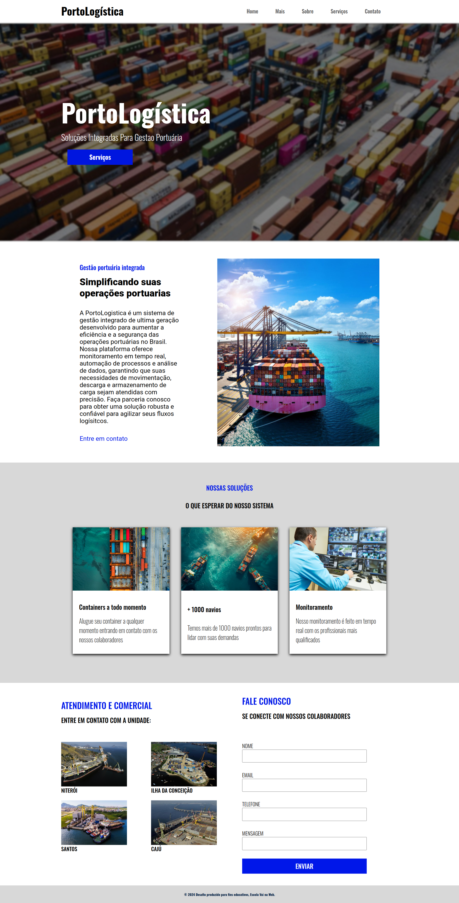

# **Projeto "Porto Logística" - Desenvolvimento de Interface Responsiva**

## **Professor(a): Samuel Silvério**  

**Aluna: Estefany Santos**

**Data de Início:** 29/11/2024  
**Data de Entrega:** 10/01/2025, até 23:59  

---

## **📋 Objetivo**

Desenvolver uma interface responsiva para o projeto **"Porto Logística"**, utilizando técnicas modernas de design e desenvolvimento web. O desafio é criar uma página web responsiva que reproduza fielmente o layout fornecido no protótipo do Figma.

---

## **✅ Requisitos Técnicos**

### 1. **Unidades de Medida Relativas**
- Utilize unidades como **vw**, **vh** e **rem** para garantir que o layout seja responsivo e se ajuste dinamicamente a diferentes tamanhos de tela.

### 2. **Layout Flexível**
- Implemente o layout com **Flexbox**, garantindo o alinhamento e a distribuição eficientes dos elementos em diversas resoluções.

### 3. **Formulários Interativos**
- Adicione elementos de formulário, como:
  - `<form>`
  - `<input>`
  - `<textarea>`
- Simule interações com o usuário no contexto de um site de logística portuária.

### 4. **Imagem de Fundo**
- Utilize a propriedade `background-image` no CSS para inserir imagens de fundo no layout, respeitando a estética do protótipo.

### 5. **Tags Semânticas**
- Organize o conteúdo da página utilizando tags semânticas como:
  - `<header>`
  - `<section>`
  - `<article>`
  - `<footer>`
- Isso garante maior clareza e acessibilidade, tanto para usuários quanto para mecanismos de busca.

---

## **🎨 Resoluções Suportadas**

Garanta que o layout seja responsivo e funcione perfeitamente nas seguintes resoluções:

- **Mobile:** 280px a 500px  
- **Tablet:** 501px a 900px  
- **Laptop:** 901px a 1500px  
- **Desktop:** Acima de 1501px  

---

## **🛠️ Materiais de Apoio**

### **Protótipo no Figma**
O design da interface está disponível no Figma e deve ser seguido rigorosamente para a implementação:  
[🔗 Figma - Porto Logística](https://www.figma.com/design/HiQqNZdfEVGoBaxq1xZ4IK/PortoLogistica?node-id=0-1&node-type=canvas&t=smBCynahXdGvphX6-0)  

### **Conversores de Unidades**
- [Conversor de Pixel para Rem](https://nekocalc.com/px-to-rem-converter?authuser=0)  
- [Conversor de Pixel para VH / VW](https://khaledkzy.github.io/pixel-vh-vw-converter/?authuser=0)  

---

## **📂 Forma de Entrega**

### **1. Repositório GitHub**
- Suba o código para um repositório público no GitHub.
- Inclua todos os arquivos necessários, como:
  - Arquivos HTML, CSS, e Sass (se aplicável).  
  - Imagens e outros recursos estáticos utilizados.

### **2. Organização do Repositório**
Estruture seu repositório de forma clara, por exemplo:
```
/assets
  /css
  /sass
  /img
index.html
README.md
```

### **3. Envio**
- Envie o link do repositório para o professor até a data limite.

---

## **📐 Dicas de Implementação**

- **Responsividade**: Use consultas de mídia (`@media`) no CSS para ajustar o layout a diferentes tamanhos de tela.
- **Performance**: Otimize as imagens antes de usá-las no projeto para garantir um carregamento rápido.
- **Testes**: Verifique o layout em dispositivos reais ou simuladores para garantir consistência entre as resoluções suportadas.

---

## **📸 Layout de Referência**

O layout da página está ilustrado abaixo como exemplo. Certifique-se de reproduzi-lo com fidelidade:

<figure>  
      
</figure>  

---

# Projeto: Página Web Responsiva com Sass

Este projeto consiste no desenvolvimento de uma página web responsiva utilizando HTML, CSS com Sass, e uma estrutura organizada para garantir a compatibilidade em diferentes dispositivos. A página inclui as seções principais de cabeçalho, introdução, sobre, serviços, contatos e rodapé, implementando boas práticas de design responsivo.

## Estrutura do Projeto

- **Header**: Contém o logotipo e um menu de navegação com links interativos.
- **Seção Principal (Main)**: Inclui uma imagem de fundo e texto introdutório com um botão de ação.
- **Seção Sobre**: Fornece informações detalhadas sobre o site, com texto e imagens.
- **Seção Serviços**: Apresenta cartões com informações sobre serviços oferecidos.
- **Seção Contatos**: Exibe um formulário para envio de mensagens e uma galeria de imagens.
- **Footer**: Inclui informações básicas de rodapé.


## Funcionalidades

- **Design Responsivo**: Adaptado para dispositivos móveis, tablets, notebooks e desktops.
- **Interatividade**: Efeitos de hover em links e botões.
- **Rolagem Suave**: Implementada com `scroll-behavior: smooth` para uma melhor experiência do usuário.
- **Estrutura Modular**: Uso de variáveis Sass para facilitar a manutenção e consistência do design.

## Ferramentas e Tecnologias Usadas

- **HTML5**: Estrutura semântica do projeto.
- **CSS3 com Sass**: Para estilização avançada, incluindo o uso de variáveis, nesting e organização modular.
- **Google Fonts**: Fontes importadas (Oswald e Roboto) para um design moderno e elegante.
- **Editor de Código**: Visual Studio Code.
- **Versionamento**: Git e GitHub para controle de versões e colaboração.

## Estrutura de Pastas

```
assets/
├── css/
│   └── style.css
├── img/
│   └── background.png
```

## Como Executar o Projeto

1. Clone o repositório:
   ```bash
   git clone <URL-do-repositório>
   ```

2. Abra o arquivo `index.html` em um navegador.

3. Certifique-se de que a estrutura de pastas está correta para que as imagens e o CSS sejam carregados corretamente.

## Melhorias Futuras

- Adicionar animações para transições suaves entre seções.
- Implementar acessibilidade (A11y) para melhorar a usabilidade do site para todos os usuários.
- Integrar funcionalidades de backend para envio de formulários.


---

Com este projeto, o objetivo foi aplicar conceitos modernos de design responsivo e boas práticas de desenvolvimento front-end. Ele serve como um exemplo funcional e escalável para outros projetos web.

---

**💻 Boa sorte e sucesso na implementação!**


